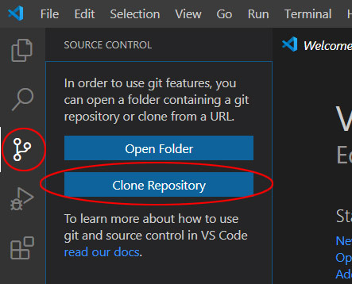

# github-with-vscode

### Reference links
- How to use Git Integration in Visual Studio Code
https://www.digitalocean.com/community/tutorials/how-to-use-git-integration-in-visual-studio-code
- Github Readme Emoji cheat sheet
https://github.com/ikatyang/emoji-cheat-sheet/blob/master/README.md
- Working with GitHub in VS Code
https://code.visualstudio.com/docs/editor/github
<br><br><br><br>

### Install Git on your machine
Go to the following website: https://git-scm.com/download.  Download file and install on your machine. 
After installed git, open command prompt and type ` git `, it will display information about git.
<br><br><br>

### Configure Username and Email in Git
Open CMD and type below command to configure username and email on current system.
```cmd
git config --global user.name "username"
git config --global user.email "user@gmail.com"
```
<br><br>

### Create a Git repository on github

- click on **new repository**
<br><br>

<br>

- Give name to repository 
<br><br>
<br>
check box **“Initialize this repository with a README”**
if you initialse project locally using git init  then do not click on checkbox, it should be unselect.
<br><br><br><br>


## Cloning a repository in VSCode
- Open Visual Studio Code and click on the Source Control tab (the icon looks like a split in the road) in the left-side panel:
- Click on `Clone Repository`<br>
<br>
- Here you have to provide repository path
<br>
You can also open above dialog box using the **Git: Clone** command in the Command Palette `(Ctrl+Shift+P)`
- After `Pres Enter Key` file browser window will open. Provide locaton to clone repository.
- After Cloned repository on given loation. Make changes in file or add any new file.<br>


- Now you’ll see in the Source Control panel that your new file shows up with the letter `U` beside it. `U` stands for untracked file, meaning a file that is new or changed, but has not yet been added to the repository:
- To commit your changes, type a commit message into the input box at the top of the Source Control panel. Then, click the check icon to perform the commit<br>


- Now All commited changes are on local repository. To upload on github repository, Click on push.<br>


- Now you will see a prompt to sign in. VS Code requires GitHub authentication first time.<br>
<br>

- Follow the steps to sign into GitHub and return to VS Code. After doing so, all local repository will upload on github repository. You must be owner or contributor of that repository.

<br><br><br><br>


## Upload an existing VSCode Project in github
follow below steps to upload an existing VSCode Project in github
- Create a repository on github & copy url
- Goto VS Code and open project/folder
- check git is enabled from settings
- **Initialise Repository** <br>
Click on Source Control icon and Initialise Repository.<br>
<br>
You can also Initialise using the **Git: Initialize Repository** command in the Command Palette `(Ctrl+Shift+P)`
 <br>
then select or choose project location.<br>

- **Commit message** <br>
Type a commit message into the input box at the top of the Source Control panel. Then, click the check icon to perform the commit<br>
<br>
- **Add to remote repository** <br>
After commit upload local git project to github, for this open Command Palette using `(Ctrl+Shift+P)` and type **Git: Add Remote**.<br>
<br>
provide repository url<br>
<br>
Give Remote name<br>
<br>

- Push commited changes to github repo<br>

- Check changes on github repo


<br><br><br><br><br><br><br><br><br><br>


## README.md Markdown Code
Github Readme Emoji cheat sheet<br>
https://github.com/ikatyang/emoji-cheat-sheet/blob/master/README.md
 
`code or highlight`
- unorder list
- unorder list
1. first
2. second
3. third

**Bold Text**
<br>


[Link to text ](https://github.com/shailendra/github-with-vscode)
<br>
*Italic text
<br>
### Heading
<br>
#### Heading
<br>
horizontal rule

----------


